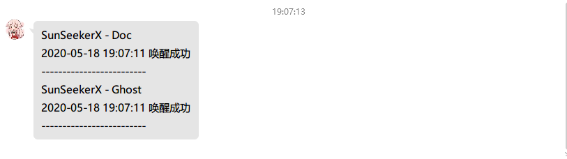

# Valine - lean-cloud唤醒函数

> 同理：[优雅解决LeanCloud流控问题](https://cloud.tencent.com/developer/article/1628950)


## 配置

```javascript
const config = {
  // 是否打开Qmsg酱
  isOpenQmsg: true,
  // Qmsg酱的key
  qmsgKey: 'xxxxxx',
  // Valine应用
  valines: [
    // SunSeekerX - Doc
    {
      // 应用名
      name: 'xxxxxx',
      // 评论管理地址
      url: 'https://leanapp-sunseekerx.yoouu.cn/comments',
    },
    // SunSeekerX - Ghost
    {
      // 应用名
      name: 'xxxxxx',
      // 评论管理地址
      url: 'https://leanapp-ghost.yoouu.cn/comments',
    },
  ],
}
```


## 部署

1️⃣ 克隆项目

```bash
git clone https://github.com/SunSeekerX/node-script.git
```


2️⃣ 服务器安装`nodejs`和`pm2`

网上找教程


3️⃣ 安装依赖

切到`node-script`根目录下

```bash
yarn

# or npm
npm i
```


4️⃣ 修改配置

配置文件就在 `node-script/lean-cloud/index.js`


5️⃣ 进入 `node-script/lean-cloud/`

```bash
# 执行
pm2 start index.js --name leanCloud-wakeUp
# 查看列表
pm2 list
# 参看日志
pm2 log
# 监控
pm2 monit
```


## 示例

